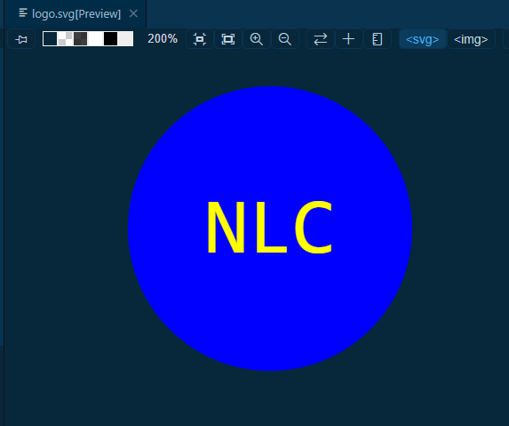

# SVG Generator

## Description

A command-line application that takes inuser input to generate a logo and saves it as a logo.svg file. A user can follow the prompts and a unique logo will be generated.

## Installation
Install inquier 8.2.4 and jest from your terminal. You can then clone this repository and run from your terminal.

## Image

## Link

https://github.com/nlewis742/SVG_generator

## Video Link

